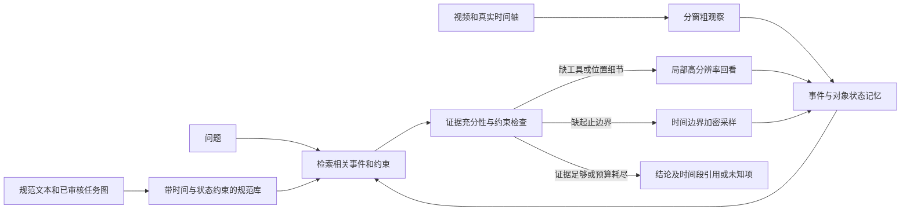

# 单卡 48GB 的操作细节理解设计

日期：2026-09-18。目标模型 Qwen3-VL-8B-Instruct；目标是动作、工具、对象、位置、时间和程序依赖的可核查理解。本文件给出工程设计与待验证假设，不声称已在真实 EgoErrorVQA 视频上取得效果。未新增下载视频或模型。

## 1. 建议采用什么方式

建议从 **分层视频观察 + 有证据的事件记忆 + 带时间/状态约束的 SOP 偏序图 + 按需回看** 开始，用冻结的 Qwen3-VL-8B 做视觉观察和受约束的解释，代码计算时长、检查依赖并管理证据。先建立可复现的免训练基线，再决定是否训练定位器或视觉适配器。

不是已被验证的“最佳方法”。关键假设是：在同等视觉 token 和总调用预算下，把计算分配给动作边界、小工具和状态变化，比整段均匀加帧更有效；必须通过消融验证。

证据与推导：

| 原始来源 | 原文短引文 | 能支持什么；不能支持什么 |
|---|---|---|
| [VideoAgent, §3 / Abstract](https://arxiv.org/html/2403.10517v1) | “iteratively identify and compile crucial information” | 支持逐轮检索/补充视觉证据；不证明其在操作计时和工具辨识上有效 |
| [VideoTree, Abstract / §3](https://arxiv.org/html/2405.19209v3) | “query-adaptive and hierarchical video representation” | 支持按问题选择层次与细节；其检索树不是 SOP 依赖图 |
| [CC4D, §3](https://arxiv.org/html/2312.14556v3) | 原文 DAG 证据见 research.md §3.2 | 支持用前置依赖而非唯一序列定义合法顺序；图边不直接提供持续时间或对象位置 |
| [IMPACT, §3–4](https://arxiv.org/html/2604.10409v1) | 原文偏序和恢复证据见 research.md §4.1 | 支持同时跟踪动作、状态、完成事件与恢复；不能仅凭一步名称判断完成 |
| [EgoErrorVQA, §5](https://arxiv.org/html/2608.24134v1) | 原文三阶段名称见 research.md §2.2 | 支持拆开步骤匹配、观察、错误判断；本设计增加证据存储、约束执行与补看，不是该论文原方法复现 |

## 2. 帧数、上下文与显存的不同限制

官方 [Qwen3-VL README](https://github.com/QwenLM/Qwen3-VL) 短引文为 “Native 256K context”；8B 的 [config.json](https://huggingface.co/Qwen/Qwen3-VL-8B-Instruct/blob/main/config.json) 中 `max_position_embeddings=262144`。这是所有输入文本、视觉 token、时间标记及输出共享的上下文容量，不是帧数，也不是 48GB 可使用的保证。

[qwen-vl-utils 官方实现](https://github.com/QwenLM/Qwen3-VL/blob/main/qwen-vl-utils/src/qwen_vl_utils/vision_process.py) 默认 `FPS=2.0`、`FPS_MAX_FRAMES=768`。Hugging Face 的 [Qwen3VLVideoProcessor](https://github.com/huggingface/transformers/blob/v4.57.6/src/transformers/models/qwen3_vl/video_processing_qwen3_vl.py) 同样默认 2fps、`max_frames=768`。这些是采样路径的默认限制，可以显式配置帧数/采样方式；不是模型架构不可跨越的 768 帧上限。不要把 `VIDEO_MAX_TOKEN_NUM=768` 和 `FPS_MAX_FRAMES=768` 当作同一概念，前者参与单帧像素约束。

8B 原始 [video_preprocessor_config.json](https://huggingface.co/Qwen/Qwen3-VL-8B-Instruct/blob/main/video_preprocessor_config.json) 的 `size.longest_edge=25165824` 是视频 **T×H×W 总像素预算**，不是图像最长边长度，也不是每帧像素上限。该配置在没有其他覆盖时对应约 12,288 个视觉 token；随帧数增加，处理器可能缩小每帧。这解释了为什么“多传帧但更看不清小工具”可能发生。处理器版本影响实际行为，必须保存 `video_grid_thw` 和 `input_ids.shape`。

本地 8B 配置与本次从官方 Hugging Face 路径经 hf-mirror 获取的配置逐项相同。模型 BF16 权重索引 `total_size=17534247392` bytes，约 **16.33 GiB**；不能只按“8B × 2 bytes”忽略视觉模块等参数。

对预处理后高宽均可被 32 整除、帧数为偶数的视频，视觉 token 近似：

`Nv = (T/2) × (H/32) × (W/32)`

原因是 `patch_size=16`、空间合并 2×2、时间 patch=2。实际以 `sum(prod(video_grid_thw))/4` 为准。单张图片没有跨两张图片的时间压缩；将视频拆成图片列表输入，不能继续按视频公式计算。

| 预处理后的每帧尺寸 H×W | 帧数 | 视觉 token，未计文字/时间/输出 | BF16 KV cache，仅这些视觉 token |
|---|---:|---:|---:|
| 384×672 | 32 | 4,032 | 0.554 GiB |
| 384×672 | 64 | 8,064 | 1.107 GiB |
| 384×672 | 128 | 16,128 | 2.215 GiB |
| 384×672 | 256 | 32,256 | 4.430 GiB |
| 576×1024 | 64 | 18,432 | 2.531 GiB |
| 576×1024 | 128 | 36,864 | 5.063 GiB |
| 384×672 | 768 | 96,768 | 13.289 GiB |

8B 文本解码器 36 层、8 KV heads、head_dim=128，BF16 的单 token KV 为 `2×36×8×128×2=147456 bytes =144 KiB`，batch=1。完整 262,144 token 的 KV 就需 **36 GiB**，加权重约 52.33 GiB，尚不含视觉编码、预填充激活和 CUDA 工作区，故本机默认 BF16 全 GPU 路径不可能仅靠 48GB 用满整个上下文。权重量化、KV 量化或卸载改变该结论的前提，但不保证细节准确或吞吐量。

上述表格是解析估算，不是峰值显存。真实峰值还取决于视觉注意力、DeepStack 特征、预填充、输出长度、FlashAttention、batch、服务框架预分配等。不能以“权重 + KV <48GB”直接宣称某个帧数必然可运行。

建议初始配置：batch=1，BF16，FlashAttention2，单次视觉预算约 8K–16K、总输入控制在约 20K 以内，输出 256–512 token 的结构化结果。粗观察 64 帧 384×672；复杂片段升级到 128 帧，或局部 16–32 帧 576×1024；需要读小字/分辨工具时加入少量高分辨率裁剪并扣除相应 token 预算。以上是起始工程配置，是否最优需按任务测量。

独占单卡的最终合成输入结果见 [capacity_results.md](capacity_results.md) 和 [原始记录](qwen3vl_profile_isolated.jsonl)。32/64/128/256/512/768 帧均成功，峰值 allocated 分别约 17.51/18.67/20.99/25.63/34.93/44.24 GiB；768 帧峰值 reserved 约 46.54 GiB，已非常接近该卡容量，不能据此给复杂真实任务承诺 768 帧安全预算。配置使用同权重线性 patch 优化，数值差异和原始慢路径记录均见容量报告。合成帧只能说明某个张量形状是否可运行，不能说明真实视频语义效果、解码延迟或绝对最大帧数。

## 3. EgoErrorVQA 实际片段长度与监督边界

`scripts/analyze_ego_duration.py` 对公开选择题 JSON 检查有限且满足 `0≤start<end` 的区间后统计；不同来源分别计算，不把开放题重复计入。结果见 [ego_duration_stats.json](ego_duration_stats.json)。

| 来源 | 有效区间数 | 中位数 / P95 / 最大值，秒 | 按 2fps 覆盖中位数约需 |
|---|---:|---|---:|
| CC4D | 947 | 33.826 / 153.304 / 539.109 | 68 帧 |
| Assembly101 | 460 | 10.917 / 50.640 / 112.567 | 22 帧 |
| EgoOops | 215 | 19.312 / 178.284 / 594.862 | 40 帧 |
| EPIC-Tent | 180 | 9.200 / 51.858 / 108.367 | 20 帧 |

EPIC-Tent 的这些数字只来自派生时间字段，不代表同步已经修复。全量负时间、逆序区间及 GoPro 时间码问题见 [data_audit.md](../data_audit.md)。

长约 10 分钟的片段若只均匀取 32 帧，采样间隔约 19 秒，容易漏掉工具更换、错误放置和短暂接触；改用 768 帧也会遇到分辨率/资源问题。因此对长片段先分窗，再用事件记忆连接。

| 需要的信息 | 可直接从哪些资产得到 | 还需补充或验证 |
|---|---|---|
| 当前步骤名称/候选步骤 | `action_annotation`、来源动作字段、procedure 文本；某些字段为空 | 文本可能描述应做动作，不能当成实际观察；无标签场景需预测 |
| 标注片段跨度 | 有效 start/end | 操作真正开始/结束、停顿、多次尝试、等待通常需细定位 |
| 工具、容器和放置关系 | 部分步骤描述、错误描述、问答参考答案会提及 | 并非统一的逐事件工具/空间真值；错误描述和答案只能用于评测，不能输入预测器 |
| 合法前置顺序 | CC4D 24 个 task graphs；其他来源的程序文字 | 其他任务需从规范构图并审核，重复动作/可选分支要显式建模 |
| 实际前后动作 | 完整源视频、源时序标注 | 单独当前步骤 clip 无法证明前一步做过或后一步实际发生 |
| 合格时长 | 部分原始步骤规范有明确秒/分钟要求 | 不应从测试片段时长反推标准，或让模型凭经验编阈值 |

例如 CC4D coffee 图确实有 bloom 等待约 30 秒、研磨约 20 秒和水温要求，也允许烧水期间准备滤杯。文本中可疑的数值/单位仍需规范审核，不能盲目信任所有原始规范字段。[官方 coffee.json](https://github.com/CaptainCook4D/annotations/blob/a8a920a3293c4db27099a20ddbe3a3a9be1283e3/task_graphs/coffee.json)

## 4. 数据结构：把应做、看到、推断分开保存

### 4.1 规范库与约束图

`StepSpec` 字段：`task_id, step_type_id, name, verb, object_types, allowed_tool_types, target_relation, preconditions, effects, duration_rule, prerequisite_ids, optional_group, repeat_rule, source_ref, verification_status`。

每个要求都保存出处。自然语言规范可先由文本模型抽取 JSON，再校验 schema、单位、引用和 DAG；模型推断的边先标为候选，不直接当作硬约束。CC4D 图中节点编号与标注 step_id 不能默认相同，要通过描述和元数据建立显式映射。

依赖 A→C、B→C 表示 A/B 都需完成才允许 C；A/B 自身可任意顺序甚至并行。不要取一个拓扑排序结果作为唯一标准。任选其一的前提需要 OR 分支/条件，普通 DAG 所有入边默认 AND 不足以表达。一般流程重复/返工会有循环：规范层可用状态机或 Petri 网扩展，或按具体尝试展开为有限事件实例；不要强行删边伪造成无环图。

### 4.2 执行事件记忆

`ActionEvent` 字段：`event_id, step_type_candidates, attempt_id, start_range_s, end_range_s, active_intervals_s, verb, object_ids, tool_ids, spatial_relations, state_before, state_after, evidence_refs, observation_status, supersedes_event_id`。

一个步骤可对应多次事件；同一对象可跨事件存在。`ObjectState` 记录 `object_id, type, appearance_refs, location_relation, containment, last_seen_s, evidence_refs`。第一视角相机移动后，“图像左边”不等于“桌面左边”，优先使用“杯内/盘上/螺孔中”等对象相对关系；精确厘米坐标需要标定、尺度和深度信息，不由 RGB VLM 凭空输出。

`Evidence` 保存原视频 ID、视角、原始时间 PTS、帧索引、裁剪框、采样参数、模型/提示版本、文件哈希和观察文本。事实、规范、推断标不同来源；被新证据推翻的事件保留版本，不静默覆盖。模型自报置信度不当作经过校准的概率。

实现首版：SQLite 存事件、关系和证据索引，图用邻接表；帧/裁剪/特征放文件缓存。先按 task/video/object/time/依赖确定性检索，再按需要加向量检索。向量相似度不能取代时序约束；长摘要不能替代可回看的原始证据。

### 4.3 两类图各司其职

SOP 图表达“哪些条件必须先满足”；执行事件图表达“实际发生了什么、何时发生、哪些对象改变”。推理阶段将两者对齐。实际上一条事件不一定是规范前驱，实际下一条事件也不一定是推荐下一步。完成状态被后续动作破坏时，即使历史上做过前置步骤，也可能仍不满足当前前提。

## 5. 推理流程和工具接口

1. **建立时间轴与基础观察。** 读取 PTS 和源视频元数据；先以约 1–2fps 观察 20–40 秒窗口，可使用 2–4 秒重叠。具体长度是待调参数。要求模型输出动作候选、可见工具/对象、状态变化和粗边界。先观察，后提供预期步骤做比较，降低把规范复述成观察的倾向。跨窗口事件按时间重叠、对象和动作合并，不能把同一步的两个尝试合成一条。
2. **检索。** 工具 `query_events(video_id, time_range, object_id, step_type)`、`get_requirements(step_type)` 和 `get_evidence(evidence_id)` 返回相关事件及依赖祖先。不能永远只看相邻一步：远处的工具取用、加料和预热也可能影响当前动作。
3. **细化观察。** 工具 `inspect_clip(start_s,end_s,fps,max_visual_tokens)`、`inspect_crop(time_s,box,resolution)`。动作切换/接触变化/边界候选区加到 4–8fps；小物体问题提高局部分辨率。保留少量全景供空间关系判断。低帧率没有看见短事件不能证明事件没发生；问“是否漏步”必须保留全局覆盖和未观察区间。
4. **精算。** `measure_duration(event_id,mode)` 和 `check_preconditions(event_id,graph_version)` 在代码中计算，不让模型自由生成秒数或随意拓扑排序。
5. **受约束解释。** 输出 `verdict, observed_facts, violated_constraints, evidence_refs, unknown_fields`；每条事实必须链接视频证据。可以有短的推理摘要，没必要生成冗长自由 CoT。CoT 不能创造未拍到的事实，也不能弥补被摘要丢掉的证据。
6. **终止。** 默认每个问题最多两轮补看/固定视觉 token 总额，记录预算耗尽；仍不清楚输出 unknown。在线场景禁止检索当前时刻之后的帧；离线全视频场景允许事后确认，单独报告结果。

对于非均匀采样必须携带原始时间。把稀疏抽出的帧错误声明为连续 2fps 会扭曲动作时间；Qwen3-VL 会依帧索引和 fps 生成时间提示。对于可变帧率的视频以 PTS 为准，必要时按均匀真实时间重采样或显式组织带时间的片段，不能简单用源平均 fps 代替全部实际 PTS。[官方时间处理代码](https://github.com/huggingface/transformers/blob/v4.57.6/src/transformers/models/qwen3_vl/processing_qwen3_vl.py)

## 6. 时间和顺序的判定规则

至少区分三种时间：

- **事件跨度**：末次结束减首次开始，包含中间停顿。
- **有效操作时长**：有效活动区间的并集长度，例如真正搅拌的秒数；重叠区间不重复计数。
- **等待/工艺时长**：例如开始焖蒸到再次注水，不等于手在动的时间；过程可能与其他动作并行。

若开始边界 `s∈[sL,sU]`、结束边界 `e∈[eL,eU]`，跨度范围为 `[max(0,eL−sU), eU−sL]`。起止各仅精确到相邻采样点时，持续时间不确定区间宽度可约为两倍采样间隔。与规范区间不能明确区分时应继续细采样或报告不能确定，而不是报一个伪精确数值。

图检查使用 `satisfied / violated / unknown`。只有已确认前提不满足才标 violated；历史视频未覆盖某一步则是 unknown。在线时某步“尚未出现”也不自动等于遗漏；到明确截止点、终止状态或后续不可逆事件后才判断。做过但后来撤销的动作不能永久标 completed。

举例（虚构演示，不是数据集实测）：规范要求水壶将水倒入杯中；第 3 次尝试在 [103.0,103.5] 秒开始、[112.0,112.5] 秒结束，则跨度范围 [8.5,9.5] 秒。若有 2 秒中断，活动时长需另算。工具辨认需要壶的可见证据，倒入目标需要包含杯口/水流的全景或局部连续帧；仅凭“倒水”步骤名称不能推出使用了水壶或水确实入杯。

## 7. 数据与评估协议

应分为两个实验协议：

**A. 原始 EgoErrorVQA 评测。** 使用规定的片段、问题与允许的规范/动作信息；当前片段之外的原视频记忆会增加输入信息，不能与原论文基线无说明地并列。固定全部题目、无效时间处理与标准指标；参考答案、error_caption、errors、is_error、modified_description 等可能泄漏错误的信息不进入模型输入，具体按字段语义和原协议白名单筛选。

**B. 全过程细节监测。** 从源完整视频建立记忆，指定 offline 或 causal-online，评估当前/历史事实、时间边界、工具、空间关系、规范依赖与恢复。EgoErrorVQA 只作其中一个问答出口。当前公共 QA 并不为所有字段提供完整真值，需要先建一个独立开发/审计子集，由人工核查关键事件；不能只用原问答语义裁判当作所有细节的准确率。

建议先以 CC4D 子集切入：已有 SOP DAG 和步骤标注，适合验证顺序与时间；EgoOops 的器具/放置关系适合验证空间细节；Assembly101 更适合短时装配事件；IMPACT 的状态和恢复标注可后续单独验证状态机，但不混用视角/跨 trial 泄漏划分。规范本身有数值或顺序歧义时先标 unknown。

固定按原始视频/参与者划分开发和评测，EgoErrorVQA 没有训练集，开发样本若从基准取出必须排除在最终测试分母之外。可先建 100–200 个事件的人工小集，覆盖时长、工具、位置、偏序/并行、恢复、遮挡；这只是建议规模，不是已标注数据。不要把该小规模实验称作全量 SOTA。

指标：边界 MAE 与 tIoU；活动/等待时长 MAE 及误差区间覆盖；工具/对象 Macro-F1；空间关系 F1；前置约束违例 P/R/F1；unknown 覆盖率与回答条件准确率；证据引用经人工核查的正确率；峰值显存、每视频处理时间、每题新增视觉 token、补看次数。错误检测同时报告标准二分类和类别指标，保留官方特殊口径结果时另列。

按以下顺序消融，冻结模型与测试集：

| 变体 | 解决的问题 |
|---|---|
| B0：单片段均匀 32/64/128 帧直接回答 | 明确分辨率、帧数和预算的基础曲线 |
| B1：B0 + 显式事实字段和代码计时 | 拆分观察是否减少细节错误 |
| B2：B1 + 事件/对象记忆 | 历史信息是否帮助顺序及工具追踪 |
| B3：B2 + 已审核偏序与状态约束 | 程序约束是否减少错序判断及并行误报 |
| B4：B3 + 按需局部回看 | 相同总视觉预算下是否优于均匀增加帧数 |
| B5：自由 CoT 对照 | 更多推理文本是否真的有益，而非增加无证据解释 |

图、记忆、补看改变可见信息或调用次数，必须做匹配输入范围/总预算的对照，也单独报告离线预建记忆成本和在线检索成本。不直接宣称“记忆 + 图 + CoT”本身是新贡献；可研究的贡献是证据不足如何驱动采样、带不确定性的时间/状态约束，以及同预算下的效果。

## 8. 后续实现模块与依赖

| 模块 | 输入 → 输出 | 依赖 |
|---|---|---|
| `data/adapters` | 三/四来源标注和媒体索引 → 统一 task/video/question 记录 | 字段白名单、时间审计 |
| `video/timeline` | 视频容器 → PTS 索引/采样帧/裁剪 | 媒体，缓存索引 |
| `procedure/compiler` | 原始规范/任务图 → 已审核 StepSpec/依赖/单位 | 规范来源和语义映射 |
| `perception/observer` | 帧、真实时间、观察提示 → 可见事实/边界候选 | Qwen3-VL 处理器/模型 |
| `memory/store` | 事件与证据 → SQLite/帧特征缓存 | 实体与尝试 ID，版本管理 |
| `reasoning/checker` | 事件、约束、问题 → 违反/满足/未知及待补证据 | 时间区间运算、状态更新 |
| `controller/refine` | 待补证据与资源预算 → 补看任务/终止 | 检索、局部采样、显存预算 |
| `evaluation` | 预测和独立真值 → 各字段指标/资源统计 | 固定协议，禁止答案输入 |

长视频按窗口提交事务并记录完成键 `(video_hash, window, model_revision, prompt_version, sampler_config)`；推理中断从最近已完成窗口恢复。SQLite 批量写，帧索引和特征向量批量处理；解码、观察、推理解耦。保留可复用帧/特征，不保存多份同一视频拷贝。

此轮已完成的是设计、标注统计与有限容量核验；完整视频处理系统和真实视频实验仍属后续实现范围。
