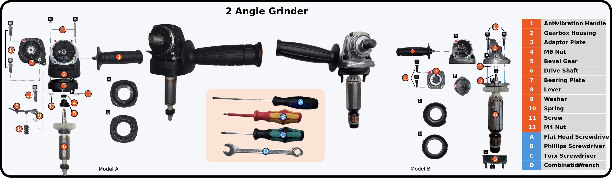

# IMPACT 工具、部件及 A/B 配置知识块

已对照官方型号爆炸图、装配手册、全部 front TAS-B 词表、92 份 ASR，以及 34 张 GT 选取或型号核对视频帧。此文件用于背景识别和功能解释；本次没有开展加入知识块前后的 VLM 效果对照实验。

## 主要结论与计数

- 官方图为 12 类部件、4 类工具；Model-A 的 ASR 将其中五颗螺丝和两颗 M4 螺母区分位置，因此是 17 个组件实例。这两个计数口径一致。
- 用户所说“小帮手”若指桌上银色短工具，对应小扳手，即 combination wrench；三个改锥分别是一字、十字、Torx 六瓣梅花。
- 模型 A/B 是两种角磨机配置。图中的蓝色 A/B/C/D 则是四种工具编号，黑色字母又用于局部视图；三者不要混淆。
- 所有精确物料、螺纹规格、扭矩、内部啮合和装配完成性，仍需逐 clip 证据；本文把功能解释与直接 GT 分开。

## 两种型号的差异

| 项目 | Model A | Model B |
|---|---|---|
| 论文型号 | Fein CG15-125BL | Fein WSG7-115A |
| 参考外观 | 黑色齿轮箱，较粗纹理手柄；转子中段较平整 | 银灰齿轮箱，较细手柄；可见转子及铜色换向器 |
| 适配板位置 | 齿轮箱与转子进入端附近 | 官方图中位于转子另一端；视频中也可见在轴组件远端拿放 |
| 适配板紧固关系 | 两颗长螺丝配两颗 M4 螺母，手册使用十字改锥 | 不能复制 A 的连接关系；官方图未单列这一对 M4 螺母 |
| 拨杆组件 | 单列拨杆、弹簧、垫圈、拨杆螺丝 | 官方爆炸图未单列这组部件；不等于证明所有样本绝无相关机构 |
| 轴承板工具 | 手册展示 Torx | 已核对 B 拆卸样例展示一字改锥 |
| 数据覆盖 | 论文 92；本地文件名 93；ASR 92 | 论文 20；本地文件名 19；ASR 0 |

型号依据论文 §3.1；几何、颜色和配置差异依据官方爆炸图与保存的视频帧。没有引入未经核实的电机功率、砂轮直径或制造商零件号。

## 工具名称、外观和用途

| GT 名称／中文 | 外观线索 | 功能与已核对操作 |
|---|---|---|
| `combination_wrench` / 两用扳手（开口／梅花组合扳手、小扳手） | 细长银色金属扳手，一端开口，另一端为封闭环形梅花口。 | 夹持、旋松或拧紧六角螺母。A 型手册展示它操作齿轮箱内的轴／齿轮紧固螺母；具体 M4/M6 身份仍须核对片段 GT。 |
| `flat_head_screwdriver` / 一字螺丝刀／平口改锥 | 参考工具为黑蓝手柄、较长裸露金属杆，工作端为一字平刃。 | 操作一字槽螺丝。已核对的 B 型拆卸片段用它旋松轴承板螺丝；不表示每个片段都应使用它。 |
| `phillips_screwdriver` / 十字螺丝刀／十字改锥 | 参考工具为红黄手柄，杆身大段为红色包覆，末端露出十字批头。 | 操作十字槽螺丝。A 型手册中用于适配板的长螺丝，与对应 M4 螺母形成紧固副。不能仅凭红色包覆推断本实验涉及带电作业。 |
| `torx_screwdriver` / Torx 六瓣梅花螺丝刀／改锥 | 参考工具为绿黑手柄、裸露金属杆，批头为六瓣星形；不同于内六角。 | 操作 Torx 槽螺丝。A 型手册中用于轴承板的两颗螺丝和锁紧拨杆螺丝。 |

工具颜色由官方图例明确对应，并以样例视频核对。颜色用于辅助定位；光照、遮挡或工具替换时，不能以颜色代替 GT 和批头判断。

## 12 类部件：外观与功能

| 编号／名称 | 外观 | 功能与边界 |
|---|---|---|
| 1 / `anti_vibration_handle` / 防振侧手柄 | 黑色长条握柄，连接端有螺纹柱；图中 A 握柄较粗且表面纹理明显，B 较细。 | 提供辅助握持位置，通过自身螺纹柱旋入齿轮箱侧面的螺纹孔。不是用表内五颗独立螺丝固定。 |
| 2 / `gearbox_housing` / 齿轮箱壳体 | 有齿轮腔、安装边缘和螺纹孔的壳体；官方 A 为黑色，B 为银灰色。 | 容纳和支撑传动组件，并提供轴承板、轴组件和侧手柄的连接界面。它是装配主体，不应笼统称作电机外壳。 |
| 3 / `adapter_plate` / 适配板／环形转接件 | 深色环形件，有较大的中心孔，边缘或背面有肋条／安装结构；不能一律描述为银色金属平板。 | 起装配适配、定位作用。A 中位于转子进入齿轮箱的一侧，用适配板螺丝及 M4 螺母固定；B 的官方图将该件画在转子另一端。具体承载、绝缘或导风功能未由资料明确，不写成定论。 |
| 4 / `M6_nut` / M6 螺母 | 图中位于小锥齿轮／传动轴端的六角螺母；A 参考图为深色。 | 在图示装配中将小锥齿轮保持在传动轴端。若具体 TAS-B 将同段称为 M4，需记录冲突，不能自动替换答案。 |
| 5 / `bevel_gear` / 小锥齿轮／小伞齿轮 | 套在传动轴入壳端的小型锥形带齿金属件；不要与轴承板组件背面的大齿轮混为一件。 | 与轴承板组件背面的较大齿轮啮合，传递并改变旋转轴方向。属于机械功能解释，不能据此断言某次已正确啮合。 |
| 6 / `drive_shaft` / 传动轴／转子轴组件 | 长轴状组件，靠一端有浅色风扇轮；A 的中段外观较平整，B 可见转子及铜色换向器区域。 | 将旋转传到壳体内的小锥齿轮。粗粒度步骤称 rotor assembly，细粒度名词称 drive_shaft；不要与轴承板上伸出的输出轴混淆。 |
| 7 / `bearing_plate` / 轴承板／轴承板组件 | 有中心轴承及输出轴、内侧带较大齿轮的板状组件。图中 A 为深色板体配金属环，B 主要为银色。 | 支撑、定位输出轴，并封合齿轮腔。A 的两颗 bearing_screw 将该组件固定到齿轮箱壳体。 |
| 8 / `lever` / 锁紧拨杆 | A 中的小型深色长条／略弯曲拨杆，一端有安装孔。 | A 锁紧机构的一部分，与弹簧、垫圈及拨杆螺丝配套。不要进一步断言它锁住了哪一个隐藏内部结构，或锁紧动作已经成功。 |
| 9 / `washer` / 垫圈 | A 拨杆组件中的小型薄环状零件。 | 在拨杆紧固组件中起垫隔、接触承压作用；不能在遮挡时编造具体上下叠放顺序。 |
| 10 / `spring` / 弹簧 | A 拨杆组件中的小型螺旋弹簧。 | 为拨杆机构提供弹性作用／回位趋势。仅看见弹簧不能推断预紧力、力值或回位功能已经正常。 |
| 11 / `screw` / 螺丝（A 型分别跟踪五颗） | 带螺纹的紧固件；A 的适配板两颗较长，轴承板及拨杆螺丝另行标注。左上／右下属于标注身份，不能按任意视角的画面坐标直接认定。 | 适配板两颗连接适配板与壳体并配 M4 螺母；轴承板两颗连接轴承板与壳体；拨杆螺丝固定轴承板区域的拨杆／弹簧／垫圈小组件。精确压紧层次以近景证据为准。 |
| 12 / `M4_nut` / 适配板的 M4 螺母 | A 图中两颗小型六角螺母；M4 应依据标注，不按像素大小估计。不是两块独立的螺母板。 | 与 A 适配板两颗螺丝配合形成螺栓紧固连接。B 爆炸图没有单独列出这两颗螺母，不能自动套用。 |

上述“定位、支撑、传递旋转、回位”等机械功能是基于图示结构的保守解释；每项在 JSON 中通过 role_evidence_kind 标明。未把这些功能当作额外 GT 标签。

## 17 个 ASR 名称与紧固关系（A）

| ASR ID | 中文名称 | 对应关系 |
|---|---|---|
| `anti_vibration_handle` | 防振侧手柄 | 防振侧手柄 |
| `gearbox_housing` | 齿轮箱壳体 | 齿轮箱壳体 |
| `drive_shaft` | 传动轴／转子轴组件 | 传动轴／转子轴组件 |
| `bevel_gear` | 小锥齿轮 | 小锥齿轮／小伞齿轮 |
| `adapter_plate` | 适配板／环形转接件 | 适配板／环形转接件 |
| `bearing_plate` | 轴承板组件 | 轴承板／轴承板组件 |
| `screw_lever` | 锁紧拨杆螺丝 | 涉及 lever, spring, washer；A 手册工具 torx_screwdriver |
| `screw_adaptor_topleft` | 适配板左上螺丝 | 涉及 adapter_plate, gearbox_housing；配 M4_nut_plate_topleft；A 手册工具 phillips_screwdriver |
| `screw_adaptor_lowright` | 适配板右下螺丝 | 涉及 adapter_plate, gearbox_housing；配 M4_nut_plate_lowright；A 手册工具 phillips_screwdriver |
| `bearing_screw_topleft` | 轴承板左上螺丝 | 涉及 bearing_plate, gearbox_housing；A 手册工具 torx_screwdriver |
| `bearing_screw_lowright` | 轴承板右下螺丝 | 涉及 bearing_plate, gearbox_housing；A 手册工具 torx_screwdriver |
| `M4_nut_plate_topleft` | 适配板左上 M4 螺母 | 适配板的 M4 螺母 |
| `M4_nut_plate_lowright` | 适配板右下 M4 螺母 | 适配板的 M4 螺母 |
| `spring` | 弹簧 | 弹簧 |
| `lever` | 锁紧拨杆 | 锁紧拨杆 |
| `washer` | 垫圈 | 垫圈 |
| `M6_nut` | M6 螺母 | M6 螺母 |

关键修正：M4_nut_plate_* 应读作“适配板相应位置的 M4 螺母”，不是另有两块“螺母板”；drive_shaft 与 bearing_plate 上的输出轴也不是同一身份。适配板是深色环形件，不能笼统写成金属平板。

## 标注中的泛称、组合名与旧名

- `gearbox_housing_drive_shaft`：壳体与传动轴的组合体，不是新增零件。
- `spin_drive_shaft`：转动传动轴语境的标注名词，不是另一根传动轴。
- `tool`：未指明类别的工具，不能凭常识自动补成某类改锥。
- `screw`：泛称螺丝。不能从此名称直接判断是哪颗轴承板／适配板／拨杆螺丝。
- `M4_nut`：泛称 M4 螺母，不含左上／右下身份。
- `screw_plate_topleft/lowright`、`screw_bevel_topleft/lowright` 仅见于 MA07LF04_Reassembly_A_001_front_asr.json；与规范索引 7–10 对应，但本次仅记录候选映射，不自动改名。

## 核对样例与异常项

| 样例 | 时间／GT 引用 | 可支持结论 |
|---|---|---|
| AL07EJ17_Reassembly_A_002 front/top | 30.53s；TAS-B /segments/66 为拿扳手，/segments/67 为随后拧螺母 | 扳手外观与实际使用；M4/M6 名称冲突需另审 |
| 同一 A 视频 | 53.77s；front /segments/79 拿十字，/segments/80 拧螺丝 | 红黄十字工具及适配板阶段 |
| 同一 A 视频 | 90.83s；front /segments/90 拿 Torx 后的上下文 | 绿黑工具识别；该帧本身不证明已拧紧 |
| AL07EJ17_Disassembly_B_005 front/top | 26.97s；front /segments/38 拿一字，/segments/40 旋松螺丝；TAS-S extract_bearing_plate_assembly | B 的一字改锥及轴承板拆卸 |
| MA07LF04_Reassembly_B_005 front/top | 139.97s、457.17s | B 轴承板、轴组件与适配板外观／位置；不是完成性证据 |
| KE03ER16_Disassembly_A_001 front/top | 0s | 文件虽无 ASR，但黑壳外观符合参考 A；不能以计数差额改归 B |

- `model_count_mismatch`（unresolved）：论文 A=92/B=20，本地 TAS-B/front 文件名 A=93/B=19。缺少 ASR 的 A 文件为 KE03ER16_Disassembly_A_001_front；其首帧为黑壳 A 外观，不能仅凭差额将它改归 B。
- `nut_identity_conflict`（unresolved）：约 30.53s 时 TAS-B 是 tighten_M4_nut；同一装配的官方图及 ASR 将转子／锥齿轮紧固件关联到 M6_nut。可描述拧紧内部螺母，但需要精确规格的题应先复核。
- `b_lever_label_conflict`（unresolved）：B 爆炸图未单列拨杆组，但本地两个 B 视频的 TAS-S 共出现三段 remove_locking_lever_assembly。不能据共享词表或粗粒度标签断言 B 具备与 A 完全相同的组件。
- `state_change_snapshot_trap`（addressed_in_builder）：部分 state_changes 保存重复状态快照；本次统计复用 changes()，以相邻 state_sequence 向量真实差分计数。同帧变化仅为辅助证据，不代表直接机械连接或先决顺序。

## 全量离线核对

- 覆盖 112 份 TAS-B/front、92 份 ASR；19 个 TAS-B 名词、17 个规范 ASR 名称及 4 个旧名均有解释，未覆盖名称为 0。
- ASR 原始 state_changes 有 11121 行；真实相邻向量差分为 3231 个组件变化，分布于 1355 个帧时刻。不能把原始行数直接当变化次数。
- 同时变更是关联佐证，不是机械连接或顺序因果证明。精确频数和源文件 SHA256 保存在 object_knowledge/audit.json、source_manifest.json。

工具 pick_up 次数（包括正常、异常、恢复；只描述标注分布，不能据频率判定正确工具）：

| 模型 | 一字 | 十字 | Torx | 扳手 |
|---|---|---|---|---|
| A | 4 | 158 | 249 | 112 |
| B | 34 | 54 | 4 | 21 |

## Prompt 文件与建议嵌入位置

- `prompts/impact_qa/v28r_object_knowledge.txt`：完整可审阅知识块。
- `prompts/impact_qa/v28r_object_knowledge_A.txt`、`_B.txt`：按型号裁剪的版本；B 不注入 A 的五颗 ASR 螺丝实例及拨杆/M4 组件组。
- `prompts/impact_qa/v28r_object_knowledge.json`：逐部件、逐工具、证据来源、型号差异、未解决问题及汇总。
- 推荐位置：任务说明与片段型号之后、逐 clip GT 和视频证据之前。来源/冲突记录保留在旁路元数据，模型只读取适用的知识块与当前 clip 证据。
- 适用于选题、生成与复查共同的命名参考；异常分类仍需要 GT 时间区间和视觉证据，不能把空拿工具或放回部件时持工具直接定义为异常。
- 此任务输出的是可复用资料；现有批量生成配置没有自动加入本知识块，也没有据此重生成已有 QA。效果提升尚未测量。

## 一手来源与原文短摘

- 论文原文：“12 components and 4 tool types”。[§3.1](https://arxiv.org/html/2604.10409v1)
- 论文原文：“differs in component connectivity and required tool operations”。[§3.1](https://arxiv.org/html/2604.10409v1)
- 论文原文：“partial-order prerequisite graph”。[§3.1](https://arxiv.org/html/2604.10409v1)
- [official_figure](https://github.com/Kratos-Wen/IMPACT/blob/4fed5faa5f05f7aece55712e458defa1f372b248/website/assets/figures/2anglegrinderconfig.svg)；本地 `sources/impact_docs/2anglegrinderconfig.svg`。
- [manual](https://github.com/Kratos-Wen/IMPACT/blob/4fed5faa5f05f7aece55712e458defa1f372b248/website/assets/figures/Manual_Book.svg)；本地 `sources/impact_docs/Manual_Book.svg`。
- [psr_names](https://huggingface.co/datasets/KratosWen/IMPACT)；本地 `annotations/impact/IMPACT-v1.1/annotations/PSR/labels/component_names.json`。

官方图以固定 commit 的 Git blob SHA1 验证，SHA256 写入知识 JSON；网络镜像只负责传输，图示内容来自官方仓库。视频样例的视角、时间戳、原始 GT 引用及图像 SHA256 保存在 visual_evidence.json。
